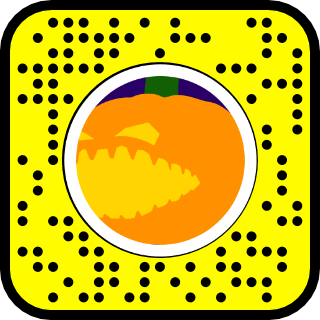
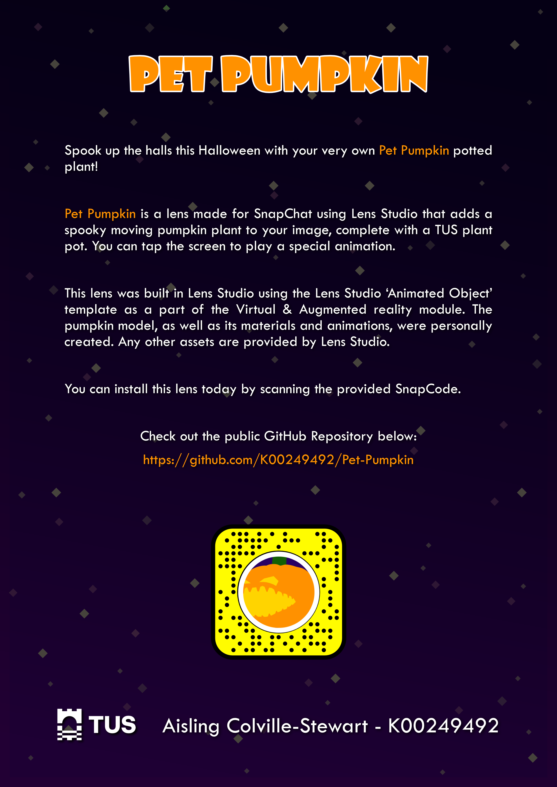

# Pet Pumpkin

## Rationale

I was tasked to create an augmented reality lens for use with Snapchat, with emphasis placed on original asset creation. 

This was achieved using Lens Studio and the project published as a GitHub repository, in accordance with the brief. However, due to the 100MB GitHub file size limit,  the git lfs extension had to be used. 

As it was required that at least 25% of the total assets be personally created, I decided to take a model of a pumpkin plant I had previously started as part of a different project and completed it with a plant pot. 

Since TUS branding was required, I placed the TUS logo on the plant pot when texturing. 

Since there had to be at least one triggered event, and as I was basing my project around an animated 3D model, I chose to build off the ‘Animated Object’ Lens Studio Template, which includes some ready-made scripting for an animation to trigger when the user taps the screen around the model.

As it appears that private repositories cannot be forked in the LIT-IDM organization, this requirement could only be fulfilled by creating a new repository and filling it with the same contents.

## SnapCode

## Poster

## Video

